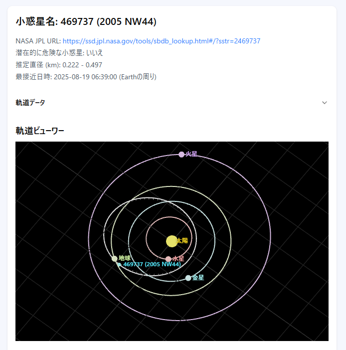

## 起動方法


まず、開発サーバーを起動します:

```bash
npm run dev
```

ブラウザで [http://localhost:3000](http://localhost:3000) を開き、結果を確認してください。


## プロジェクトの作成

このプロジェクトは、以下のコマンドで作成されました。

```bash
npx create-next-app@latest astro-voyage
```


## プロジェクト概要

このプロジェクトは、NASA API から取得したデータ表示を行うサンプルアプリケーションです。

#### 地球近傍天体 軌道データ


### 環境変数

本プロジェクトを実行するには、ルートディレクトリに `.env.local` ファイルを作成し、以下の環境変数を設定する必要があります。


```
NASA_API_KEY=取得したAPIキー
```


NASA API キーは以下から取得できます。
```
https://api.nasa.gov/
```

### 導入ライブラリ

導入ライブラについては、[導入ライブラリ.md](docs/導入ライブラリ.md) を参照してください。

### レスポンシブなサイドバー

このサイドバーメニューは、画面の幅に応じて表示が切り替わります。

#### デスクトップビュー (幅 768px 以上)

#### モバイルビュー (幅 768px 未満)

モバイル画面では、サイドバーはデフォルトで非表示となり、メニューボタンをクリックするとオーバーレイメニューが表示されます。

